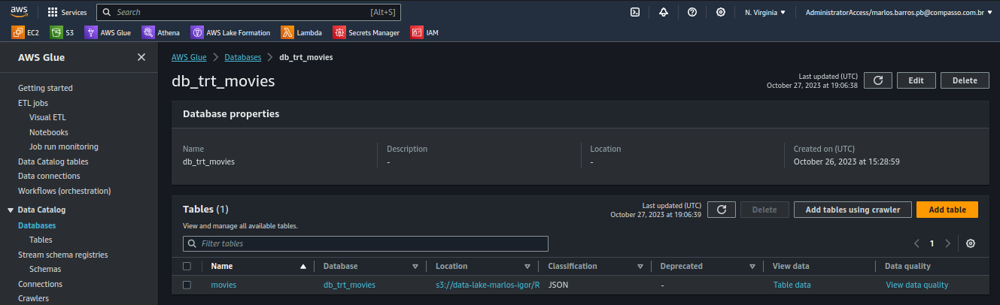

- 1 - Job de Conversão JSON para Parquet - TRT ⤵

  

- 2 - Crawler dos Arquivos Json - Movie ⤵

- Crawler dos Arquivos Json - Serie ⤵

  

- 3 - Database Movie ⤵

- Database Seire ⤵

- 4 - Script Spark (Python) de Conversão JSON para Parquet - TRT ⤵

_Json_Movie_And_Serie_Para_Parquet.png)

- 5 - Arquivos Salvos como Parquet - Movie TRT ⤵

- Arquivos Salvos como Parquet - Serie TRT ⤵

  

