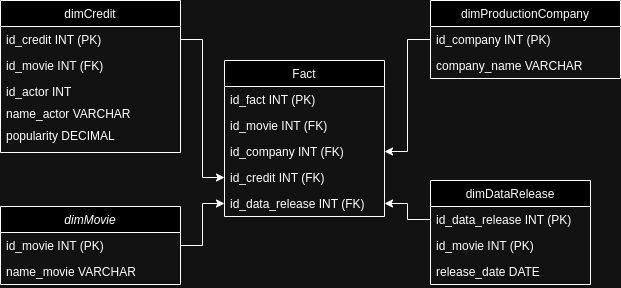
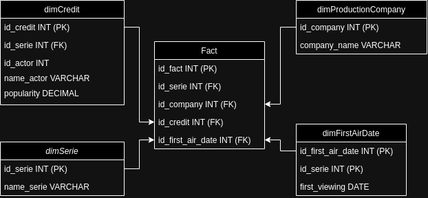

# Schema Movie ⤵  

## Explicação do esquema de dados para Series

- O esquema é composto por dimensões e uma tabela de fatos:

- dimSerie: armazena informações sobre as séries de TV, como seu ID e nome.

- dimCredit: armazena informações sobre os créditos das séries de TV, como o ID da série, o ID do ator e o nome do ator.

- dimProductionCompany: armazena informações sobre as produtoras de séries de TV, como seu ID e nome.

- dimFirstAirDate: armazena informações sobre a data de estreia das séries de TV, como o ID da série e a data de estreia.

- Fact: armazena informações sobre a relação entre as dimensões, como o ID da série, o ID da produtora, o ID do crédito, o ID da data de estreia e a popularidade do ator.

	- Explicação das colunas das tabelas:

	- dimSerie
id_serie: ID da série, um número inteiro único que identifica cada série de TV. É a chave primária da tabela.
name_serie: Nome da série de TV.
dimCredit

	- id_credit: ID do crédito, um número inteiro único que identifica cada crédito de ator. É a chave primária da tabela.
id_serie: ID da série de TV associada ao crédito.
id_actor: ID do ator associado ao crédito.
name_actor: Nome do ator associado ao crédito.
popularity: Popularidade do ator associado ao crédito.
dimProductionCompany

	- id_company: ID da produtora, um número inteiro único que identifica cada produtora de séries de TV. É a chave primária da tabela.
company_name: Nome da produtora de séries de TV.
dimFirstAirDate

	- id_first_air_date: ID da data de estreia, um número inteiro único que identifica cada data de estreia de uma série de TV. É a chave primária da tabela.
id_serie: ID da série de TV associada à data de estreia.
first_viewing: Data de estreia da série de TV.
Fact

	- id_fact: ID do fato, um número inteiro único que identifica cada fato sobre uma série de TV. É a chave primária da tabela.
id_serie: ID da série de TV associada ao fato.
id_company: ID da produtora associada ao fato.
id_credit: ID do crédito associado ao fato.
id_first_air_date: ID da data de estreia associada ao fato.
popularity: Popularidade do ator associado ao fato.

	- 

# Schema Serie ⤵
  
## Explicação do esquema de dados para Movies  

- O esquema de dados para filmes é semelhante ao esquema de dados para séries de TV. Ele é composto por cinco dimensões e uma tabela de fatos:

- dimMovie: armazena informações sobre os filmes, como seu ID e título.
	
- dimCredit: armazena informações sobre os créditos dos filmes, como o ID do filme, o ID do ator e o nome do ator.
	
- dimProductionCompany: armazena informações sobre as produtoras de filmes, como seu ID e nome.
	
- dimDataRelease: armazena informações sobre a data de lançamento dos filmes, como o ID do filme e a data de lançamento.
	
- Fact: armazena informações sobre a relação entre as dimensões, como o ID do filme, o ID da produtora, o ID do crédito, o ID da data de lançamento e a popularidade do ator.

	- Explicação das colunas das tabelas:  

	- dimMovie
id_movie: ID do filme, um número inteiro único que identifica cada filme. É a chave primária da tabela.
title: Título do filme.
dimCredit

	- id_credit: ID do crédito, um número inteiro único que identifica cada crédito de ator. É a chave primária da tabela.
id_movie: ID do filme associado ao crédito.
id_actor: ID do ator associado ao crédito.
name_actor: Nome do ator associado ao crédito.
popularity: Popularidade do ator associado ao crédito.
dimProductionCompany

	- id_company: ID da produtora, um número inteiro único que identifica cada produtora de filmes. É a chave primária da tabela.
company_name: Nome da produtora de filmes.
dimDataRelease

	- id_data_release: ID da data de lançamento, um número inteiro único que identifica cada data de lançamento de um filme. É a chave primária da tabela.
id_movie: ID do filme associado à data de lançamento.
release_date: Data de lançamento do filme.
Fact

	- id_fact: ID do fato, um número inteiro único que identifica cada fato sobre um filme. É a chave primária da tabela.
id_movie: ID do filme associado ao fato.
id_company: ID da produtora associada ao fato.
id_credit: ID do crédito associado ao fato.
id_data_release: ID da data de lançamento associada ao fato.
popularity: Popularidade do ator associado ao fato.

	- 

