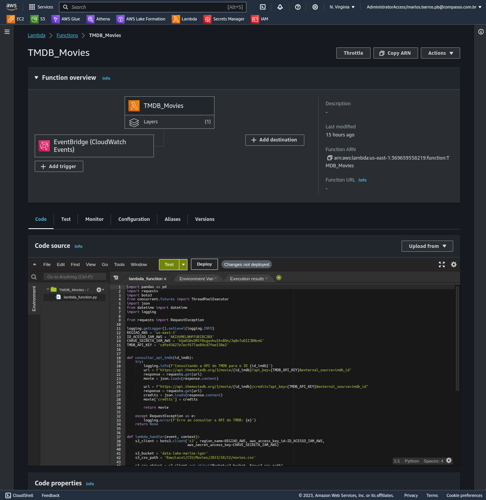
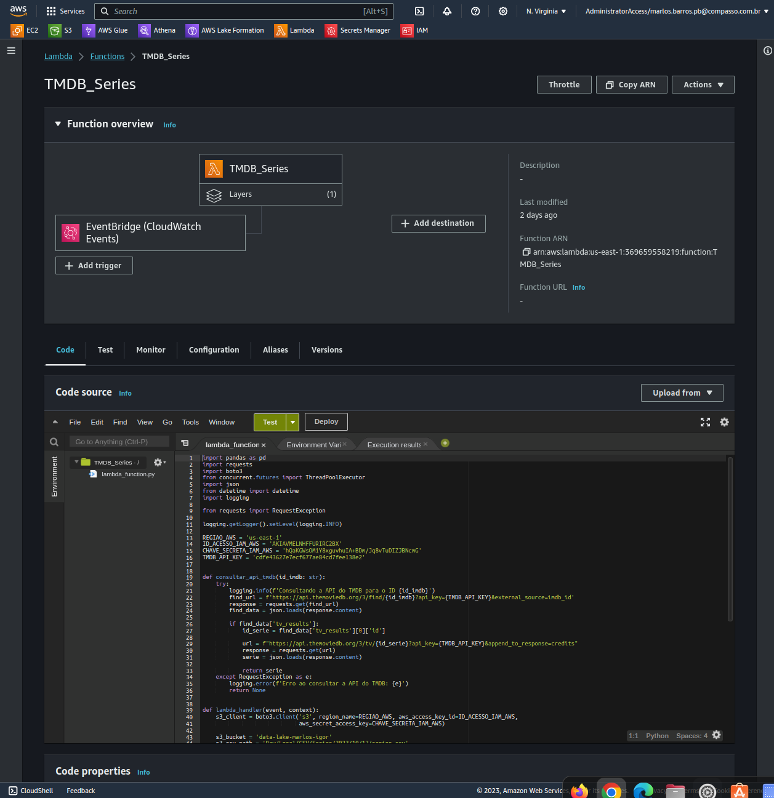
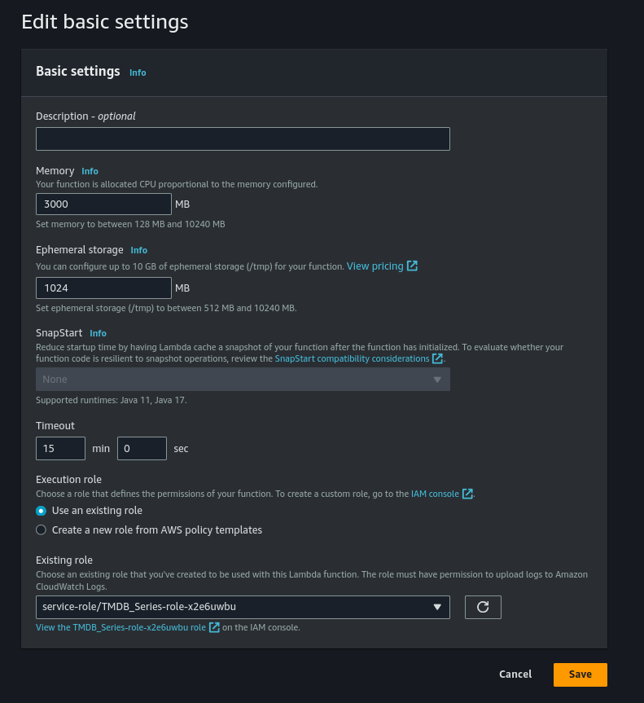
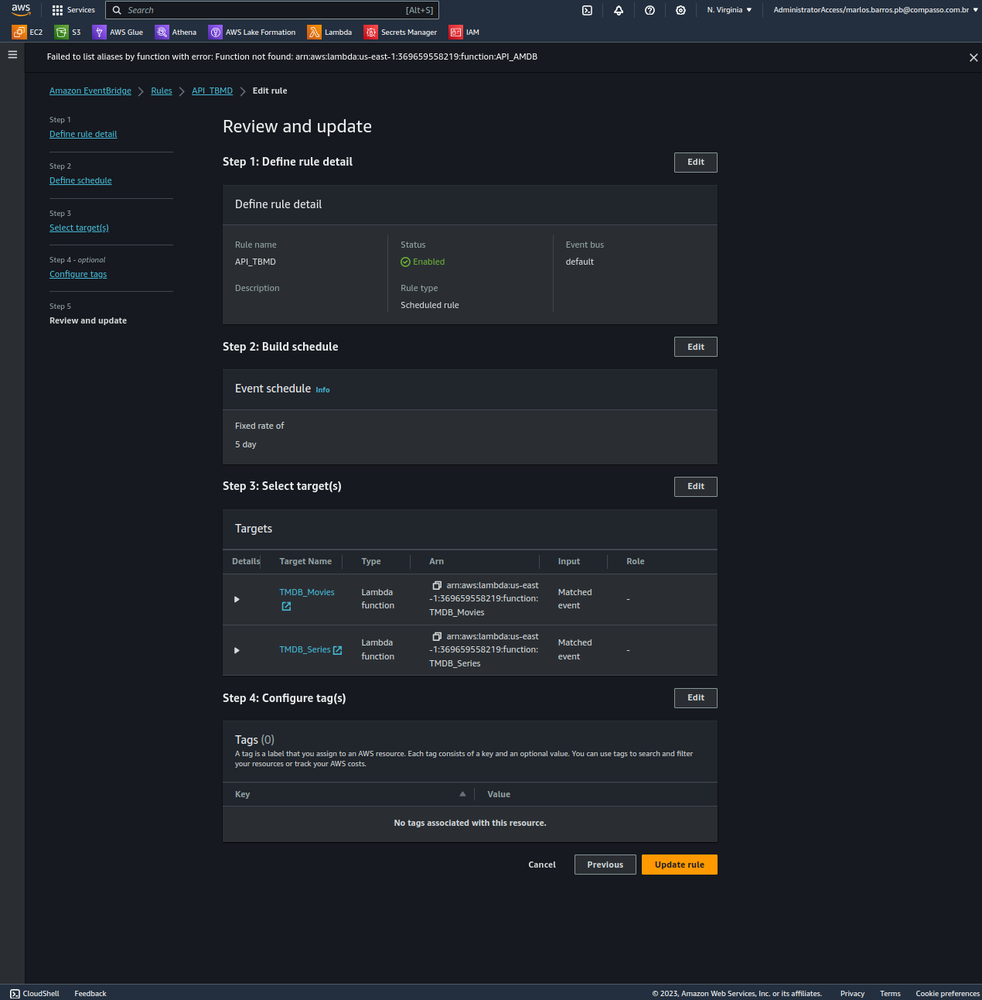

- Criei uma função lambda para fazer chamadas a api TMDB

- Aumentei a memória da CPU alocada e o tempo limite da execução:

- Capturei os dados do TMDB utilizando uma função AWS Lambda para fazer
chamadas à API. Os dados que coletei foram armazenados no Amazon S3, na
camada RAW Zone, mantendo o formato original (JSON). Além disso, consegui
agrupá-los em arquivos contendo no máximo 100 registros cada:  

- Configurei um sistema de automação utilizando o Amazon EventBridge, que
aciona a coleta de dados a cada 5 dias para manter nossas informações
sempreatualizadas:  

- Capturei os filmes e séries e os separei por pasta, cada arquivo JSON na pasta de
filmes contém 100 registros do gênero Ação/Aventura:  
 
 # 
	Movie
  

	Serie
  

	General Configuration

	EventBridge

